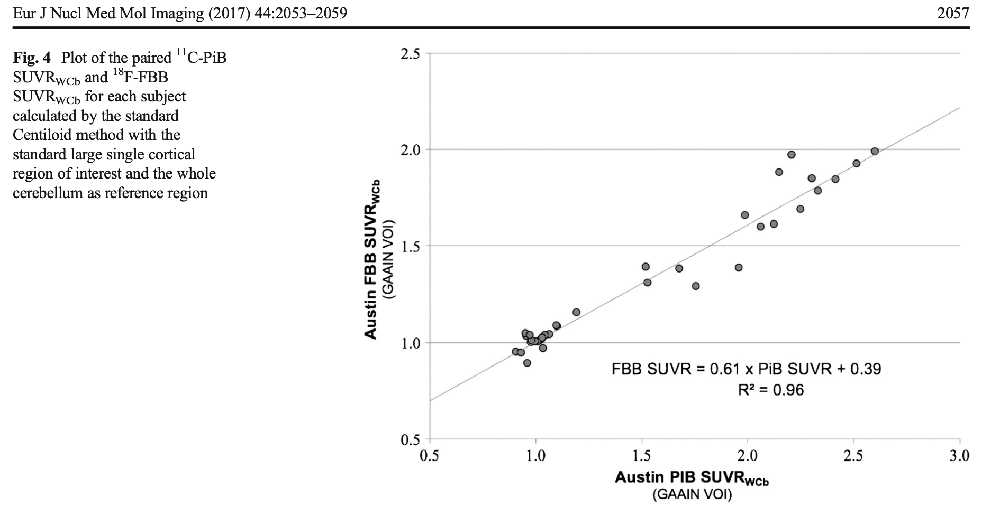
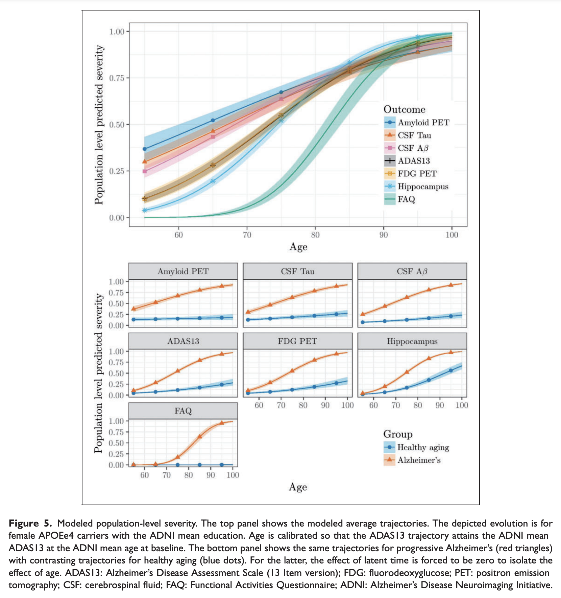

class: middle, center

# Biostatistics for Imaging Biomarkers & Introduction to Longitudinal Data

Michael Donohue, PhD

University of Southern California

### Biomarkers in Neurodegenerative Disorders

University of Gothenburg

May 26, 2021

```{r setup, echo=FALSE, message=FALSE, warning=FALSE}
# For ADNIMERGE, go to http://adni.loni.usc.edu/, https://adni.bitbucket.io/

library(Hmisc)
library(knitr)
library(tidyverse)
library(kableExtra)
library(gridExtra)
library(plotly)
library(nlme)
library(emmeans)
library(arsenal)
library(grid)
library(gridExtra)
library(mvtnorm)
library(mice)

options(digits=2)

theme_set(theme_bw())

# http://www.cookbook-r.com/Graphs/Colors_(ggplot2)/#a-colorblind-friendly-palette
cbbPalette <-
    c("#0072B2", "#D55E00", "#E69F00",
      "#009E73", "#F0E442", "#999999",
      "#000000", "#56B4E9", "#CC79A7")
scale_colour_discrete <-
    function(...) scale_colour_manual(..., values = cbbPalette)
scale_fill_discrete <-
    function(...) scale_fill_manual(..., values = cbbPalette)
scale_colour_discrete <-
    function(...) scale_colour_manual(..., values = cbbPalette)
scale_fill_discrete <-
    function(...) scale_fill_manual(..., values = cbbPalette)

theme_table <- function(..., levs=2){
  theme_minimal(...) + 
    theme(
      panel.grid = element_blank(), 
      axis.text.x = element_blank(),
      axis.text.y = element_text(face='bold', color=cbbPalette[1:levs]),
      axis.title = element_blank())
}

center <- function(x) scale(x, scale = FALSE)
```
  
```{r knitr-options, echo=FALSE, message=FALSE, warning=FALSE, purl=FALSE}
knitr::opts_chunk$set(
  collapse = TRUE,
  comment = NA,
  echo = FALSE, cache = TRUE, 
  cache.path = 'imaging_cache/',
  fig.path = 'imaging_fig/',
  dev='svg',
  tidy=FALSE,
  out.extra = '',
  out.width='100%',
  fig.align = 'center', crop = TRUE, fig.pos = '!h', 
  fig.height=3, fig.width=3*2.2,
  message = FALSE, 
  warning = FALSE
)
# knitr::knit_hooks$set(inline = function(x) {
#   prettyNum(x, big.mark=",")
# })
# purl('imaging.Rmd')
```

```{r load_refs, include=FALSE, cache=FALSE, purl=FALSE}
library(RefManageR)
BibOptions(check.entries = FALSE,
  bib.style = "authoryear",
  cite.style = "authoryear",
  style = "markdown",
  hyperlink = FALSE,
  dashed = FALSE,
  max.names = 1)
bib <- ReadBib("./references.bib", check = FALSE)
NoCite(bib, c('properzi2019nonlinear', 'rowe201718', 'klunk2015centiloid', 'navitsky2018standardization', 'li2019bayesian'))
# Citet(), Citep(), AutoCite()
```

.pull-left[

```{r echo=FALSE, fig.align='center', out.width='57%', purl=FALSE}
knitr::include_graphics("./images/atri.png")
```

]

.pull-right[

```{r echo=FALSE, fig.align='center', out.width='47%', purl=FALSE}
knitr::include_graphics("./images/actc_logo.png")
```

]

---

# Session 2 Outline

.large[
- Reference Regions
- Centiloids
- Standardization using the Empirical Cumulative Distribution Function (ECDF)
- Intro to longitudinal data analysis
  - Summaries and plots
  - Regression
  - ANCOVA
  - Two-stage models
]

---

class: inverse, middle, center

# Reference Regions

---

# Reference Regions

.large[
A common issue with statistical analyses of numeric summaries derived from imaging data is normalization to a reference region. 

Examples:

- Volumetric MRI: regional (e.g. hippocampal) volume relative to IntraCranial Volume (ICV)
- Amyloid PET: cortical-to-cerebellum Standardized Uptake Value Ratio (SUVr)

(Also an issue in non-imaging data, e.g. ratio of CSF $\textrm{A}\beta_{1-42}$ to $\textrm{A}\beta_{1-40}$)
]

---

# Beware the "Ratio Fallacy" and "Spurious Correlation"
.large[
> Spurious correlation refers to the correlation between indices that have a common component. A 'per ratio' standard is based on a biological measurement adjusted for some physical measurement by division. Renowned statisticians and biologists (Pearson, Neyman and Tanner) have warned about the problems in interpretation that ratios cause. This warning has been largely ignored. The consequences of using a single ratio as either the dependent or one of the independent variables in a multiple-regression analysis are described. It is shown that the use of ratios in regression analyses can lead to incorrect or misleading inferences. A recommendation is made that the use of ratios in regression analyses be avoided.

`r Citet(bib, 'kronmal1993')` "Spurious correlation and the fallacy of the ratio standard revisited". *Journal of the Royal Statistical Society: Series A*.

Examples abound: %ICV, SUVR, BMI, ...
]

---

# Ratio as Dependent Variable in Regression

```{r }
dd2 <- subset(ADNIMERGE::adnimerge, VISCODE=='bl' & !is.na(Hippocampus) & DX=='CN') %>%
  mutate(APOEe4 = ifelse(APOE4>0, 1, 0))
```

```{r , echo=TRUE}
lm_fit1_gender <- lm(I(Hippocampus/ICV*100) ~ PTGENDER, data=dd2)
```

```{r }
summary(lm_fit1_gender)$coef %>%
  as_tibble(rownames = NA) %>% 
  rownames_to_column(var='Coefficient') %>%
  mutate(`Pr(>|t|)` = format.pval(round(`Pr(>|t|)`, digits = 3), eps = 0.001, digits=3)) %>%
  kable()
```

- Signficant association between Gender and Hippocampal Volume (%ICV)!
- (This linear model is essential just a two-sample t-test)
- Model fit to ADNI CN

---

# ICV as Covariate Instead of Denominator

```{r , echo=TRUE}
lm_fit2_gender <- lm(Hippocampus ~ ICV + PTGENDER, data=dd2)
```

```{r }
summary(lm_fit2_gender)$coef %>%
  as_tibble(rownames = NA) %>% 
  rownames_to_column(var='Coefficient') %>%
  mutate(`Pr(>|t|)` = format.pval(round(`Pr(>|t|)`, digits = 3), eps = 0.001, digits=3)) %>%
  kable()
```

- No association between Gender and Hippocampal Volume ( $\text{mm}^3$ )!
- The **spurious association** in first model is driven by denominator (ICV), not numerator (hippocampal volume)

---

# Hippocampus vs ICV and Gender

.pull-leftWider[
```{r hipp_gender_scatter, fig.height=4, fig.width=6}
ggplot(dd2, aes(y=Hippocampus, x=ICV, color=PTGENDER)) +
  geom_point(alpha=0.5) +
  geom_smooth(method='lm') +
  xlab(expression(paste("ICV (", m*m^{3},")"))) +
  ylab(expression(paste("Hippocampus (", m*m^{3},")"))) +
  theme(legend.position = c(0.2, 0.8))
```
]

.pull-rightNarrower[

- For a given ICV, there is not much difference between genders
- These linear fits are more flexible than model above (two slopes for ICV vs one)

]

---

# Hippocampal volume ( $\textrm{mm}^3$, %ICV, and model-adjusted)

```{r hipp_gender_box, fig.height=4, fig.width=4*2}
p1 <- ggplot(dd2, aes(y=Hippocampus, x=PTGENDER)) +
  geom_boxplot(outlier.shape=NA) +
  geom_dotplot(binaxis='y', stackdir='center', 
    dotsize=0.3, alpha=0.2, binwidth=100) +
  xlab('') + ylab(expression(paste("Hippocampus (", m*m^{3},")")))

p2 <- ggplot(dd2, aes(y=ICV, x=PTGENDER)) +
  geom_boxplot(outlier.shape=NA) +
  geom_dotplot(binaxis='y', stackdir='center', 
    dotsize=0.3, alpha=0.2, binwidth=15000) +
  xlab('') + ylab(expression(paste("ICV (", m*m^{3},")")))

p3 <- ggplot(dd2, aes(y=(Hippocampus/ICV*100), x=PTGENDER)) +
  geom_boxplot(outlier.shape=NA) +
  geom_dotplot(binaxis='y', stackdir='center', 
    dotsize=0.3, alpha=0.2, binwidth=0.0075) +
  xlab('') + ylab("Hippocampus (%ICV)")

p4 <- ggplot(dd2, 
  aes(y=Hippocampus-ICV*coef(lm_fit2_gender)['ICV'], x=PTGENDER)) +
  geom_boxplot(outlier.shape=NA) +
  geom_dotplot(binaxis='y', stackdir='center', 
    dotsize=0.3, alpha=0.2, binwidth=100) +
  xlab('') + ylab(expression(paste("Hippocampus (", m*m^{3},", model-adjusted for ICV)")))

grid.arrange(p1,p2,p3,p4, nrow=1)
```

---

# Hippocampal volume ( $\textrm{mm}^3$, %ICV, and model-adjusted)

.pull-leftWider[

```{r hipp_adj_gender_scatter, fig.height=4, fig.width=6}
ggplot(dd2, 
  aes(y=Hippocampus-ICV*coef(lm_fit2_gender)['ICV'], x=ICV, color=PTGENDER)) +
  geom_point(alpha=0.5) +
  geom_smooth(method='lm') +
  xlab(expression(paste("ICV (", m*m^{3},")"))) +
  ylab(expression(paste("Hippocampus (", m*m^{3},", model-adjusted for ICV)"))) +
  theme(legend.position = c(0.2, 0.8))
```

]

.pull-rightNarrower[

- Model: 
.small[
$Y_i=\beta_0 + \beta_{\textrm{ICV}}\textrm{ICV}_i  + \beta_{\textrm{Male}}\textrm{Male}_i + \varepsilon_i$
]
- Adjusted volume: $Y_i - \hat{\beta}_{\textrm{ICV}}\textrm{ICV}_i$ 
- Adjustment removes slope for ICV

]

---

class: inverse, middle, center

# Centiloids

---

# Centiloids

.large[

- Centiloids have become the industry standard standardized measure of amyloid PET `r Citep(bib=bib, 'klunk2015centiloid')`
- Helpful in multi-site studies where different amyloid PET tracers might be utilized.
- What is a centiloid?

]

---

# What is a centiloid? Step 1: PiB SUVr to CL

.large[

- The original/base PiB SUVr to centiloid map:
- 1.009 PiB SUVr (mean in young controls) $\rightarrow$ 0 CL
- 2.076 PiB SUVr (mean in AD cases) $\rightarrow$ 100 CL
- For other PiB SUVr values, draw the line from (1.009 SUVr, 0 CL) to (2.076 SUVr, 100 CL)

]

---

# What is a centiloid? Step 1: PiB SUVr to CL

```{r }
ggplot() + 
  geom_segment(aes(x=1.009, y=0, xend=2.076, yend=100),
    arrow = arrow(length = unit(0.03, "npc"), ends='both')) +
  geom_abline(slope = 100/(2.076-1.009), 
    intercept=-1.009*100/(2.076-1.009), linetype='dashed') +
  geom_point(aes(x=1.009, y=0)) +
  geom_point(aes(x=2.076, y=100)) +
  xlab('PiB SUVr') + ylab('Centiloid') +
  xlim(1, 3) + ylim(-5, 200)
   
```

---

# What is a centiloid? Step 2: Other SUVr to PiB SUVr

.large[

- Step 2 requires *paired* data: each individuals scanned with PiB and the other tracer
- Linear regression (ordinary least squares) is used to create linear transformation
- Transformed data is then mapped to CL using map on prior slide

]

---

# What is a centiloid? Step 2: Other SUVr to PiB SUVr

```{r echo=FALSE, fig.align='center', out.width='75%', purl=FALSE}

```

$\textrm{SUVR}_{\textrm{FBB}} = 0.61 \times  \textrm{SUVR}_{\textrm{PiB}} + 0.39$

`r Citet(bib=bib, 'rowe201718')`

---

# Distribution mapping

```{r echo=FALSE, fig.align='center', out.width='75%', purl=FALSE}
knitr::include_graphics("./images/properzi2019.png")
```

`r Citet(bib=bib, 'properzi2019nonlinear')`

???

Another approach is normalizing data from different tracers (or fluid assays for that matter) is map distributions.

If we only have unpaired data from similar populations, we can map one to other under the assumption that their distributions should have similar shape.

---

# Emprical Cumulative Distribution Function (ECDF)

```{r echo=FALSE}
pibids <- unique(subset(ADNIMERGE::adnimerge, !is.na(PIB))$RID)
av45ids <- unique(subset(ADNIMERGE::adnimerge, !is.na(AV45))$RID)
set.seed(20210506)
holdout <- sample(intersect(pibids, av45ids), size = 10)

dd <- ADNIMERGE::adnimerge %>%
  filter(!RID %in% holdout) %>%
  arrange(RID, EXAMDATE) %>%
  select(RID, DX, PIB, AV45) %>%
  rename(PiB = PIB, Florbetapir = AV45) %>%
  mutate(PiB = as.numeric(PiB), Florbetapir = as.numeric(Florbetapir)) %>%
  group_by(RID) %>%
  fill(DX, .direction = "downup") %>%
  filter(!is.na(PiB) | !is.na(Florbetapir)) %>%
  filter(!duplicated(RID)) %>%
  pivot_longer(cols=c('PiB', 'Florbetapir'), names_to='Tracer', values_to='SUVR') %>%
  mutate(Tracer = factor(Tracer, levels = c('PiB', 'Florbetapir'))) %>%
  filter(!is.na(SUVR))
  
ggplot(dd, aes(x=SUVR)) +
  stat_ecdf(geom = "step") +
  facet_grid(.~Tracer, scales='free_x')
```

???

CDFs are useful one-to-one maps

Underly random number generators. A random number from a uniform 0-1 distribution can be mapped to any other distribution by the inverse CDF.

In this case we can map PiB SUVRs to florbetapir SUVRs or vice versa

But it only works if samples are similar, and we believe both tracers would sort the samples similarly.

---

# Weighted ECDFs to correct for sampling differences

N (%) per diagnosis and tracer:

```{r , echo=FALSE}
t1 <- with(dd, table(DX, Tracer))
t2 <- round(with(dd, prop.table(table(DX, Tracer), margin = 2))*100, 1)
tt <- t1
tt[,1] <- paste(t1[,1], paste0("(", t2[,1], "%)"))
tt[,2] <- paste(t1[,2], paste0("(", t2[,2], "%)"))
kable(tt)
```

Inverse proportion weights:

```{r }
invproptab <- 1/with(dd, prop.table(table(DX, Tracer), margin = 2))
kable(invproptab)
```

??? 

similar methodology underlies CDC growth charts that provide height and weight 
percentiles per age 

---

# Weighted ECDFs to correct for sample differences

```{r , echo=TRUE}
# Record the sampling adjustment weights in the data
dd <- dd %>% mutate(
  wt = case_when(
    DX == 'CN' & Tracer == 'PiB' ~ invproptab['CN', 'PiB'],
    DX == 'MCI' & Tracer == 'PiB' ~ invproptab['MCI', 'PiB'],
    DX == 'Dementia' & Tracer == 'PiB' ~ invproptab['Dementia', 'PiB'],
    DX == 'CN' & Tracer == 'Florbetapir' ~ invproptab['CN', 'Florbetapir'],
    DX == 'MCI' & Tracer == 'Florbetapir' ~ invproptab['MCI', 'Florbetapir'],
    DX == 'Dementia' & Tracer == 'Florbetapir' ~ invproptab['Dementia', 'Florbetapir']
  ))
```

---

# Weighted ECDFs to correct for sample differences

```{r , echo=TRUE}
# Create adjusted ECDF functions (mapping SUVRs to Cumulative Probabilities)
# Hmisc::wtd.Ecdf returns a data.frame evaluating the ECDF at each observed value
PiB.ecdf.data <- with(subset(dd, Tracer == 'PiB'), 
  Hmisc::wtd.Ecdf(SUVR, weights=wt, normwt=TRUE))
Fbp.ecdf.data <- with(subset(dd, Tracer == 'Florbetapir'), 
  Hmisc::wtd.Ecdf(SUVR, weights=wt, normwt=TRUE))

# approxfun creates a function via linear interpolation 
# mapping SUVRs to cumulative probabilities (0 to 1 scale)
PiB.ecdf <- with(PiB.ecdf.data, approxfun(x, ecdf, rule=2))
Fbp.ecdf <- with(Fbp.ecdf.data, approxfun(x, ecdf, rule=2))

# Create adjusted **inverse** ECDF functions 
# mapping Cumulative Probabilities (0 to 1 scale) to SUVRs
Probs <- seq(0,1,by=0.01)
PiB.inv.ecdf.data <- as.numeric(with(subset(dd, Tracer == 'PiB'), 
  Hmisc::wtd.quantile(SUVR, weights=wt, normwt=TRUE, probs=Probs)))
Fbp.inv.ecdf.data <- as.numeric(with(subset(dd, Tracer == 'Florbetapir'), 
  Hmisc::wtd.quantile(SUVR, weights=wt, normwt=TRUE, probs=Probs)))

PiB.inv.ecdf <- approxfun(Probs, PiB.inv.ecdf.data, rule=2)
Fbp.inv.ecdf <- approxfun(Probs, Fbp.inv.ecdf.data, rule=2)
```

---

# Weighted ECDFs to correct for sample differences

```{r , echo=TRUE}
dd <- dd %>% mutate(
  `Adjusted cumulative probability` = case_when( # 
    Tracer == 'PiB' ~ PiB.ecdf(SUVR),
    Tracer == 'Florbetapir' ~ Fbp.ecdf(SUVR)),
  `Adjusted Z-score` = qnorm(`Adjusted cumulative probability`), # adjusted z-scores
  `Florbetapir to PiB adjusted SUVR` = case_when(
    Tracer == 'Florbetapir' ~ PiB.inv.ecdf(Fbp.ecdf(SUVR))),
  `PiB to Florbetapir adjusted SUVR` = case_when(
    Tracer == 'PiB' ~ Fbp.inv.ecdf(PiB.ecdf(SUVR)))
  ) %>%
  arrange(Tracer, SUVR)
```

---

# Weighted ECDFs to correct for sample differences

```{r weighted-ecdfs}
ggplot(dd, aes(x=SUVR)) +
  stat_ecdf(geom = "step") +
  facet_grid(.~Tracer, scales='free_x') +
  geom_line(aes(x=SUVR, y=`Adjusted cumulative probability`), linetype='dashed') +
  ylab('Cumulative Probability')
```

---

# Densities for estimated and actual PiB SUVRs

```{r pib-densities}
dd %>% select(RID, DX, Tracer, SUVR, `Florbetapir to PiB adjusted SUVR`) %>%
  pivot_longer(c('SUVR', 'Florbetapir to PiB adjusted SUVR'), 
    names_to = 'Source', values_to = 'SUVR') %>%
  filter( (Tracer == 'PiB' & Source == 'SUVR') |
      (Tracer == 'Florbetapir' & Source == 'Florbetapir to PiB adjusted SUVR')) %>%
  mutate(Source = ifelse(Source == 'SUVR', 
    'Directly observed PiB SUVR', 'ECDF mapped Florbetapir to PiB SUVR')) %>%
ggplot(aes(x=SUVR, color=Source)) +
  geom_density(alpha=0.5)
```

???

Not perfectly matched due to different sample characteristics. To be expected.

Recall PiB had less representation of CU and Florbetapir had more with dementia

---

# Densities by diagnosis

```{r pib-densities-dx}
dd %>% select(RID, DX, Tracer, SUVR, `Florbetapir to PiB adjusted SUVR`) %>%
  pivot_longer(c('SUVR', 'Florbetapir to PiB adjusted SUVR'), 
    names_to = 'Source', values_to = 'SUVR') %>%
  filter( (Tracer == 'PiB' & Source == 'SUVR') |
      (Tracer == 'Florbetapir' & Source == 'Florbetapir to PiB adjusted SUVR')) %>%
  mutate( Source = ifelse(Source == 'SUVR', 'Directly observed PiB SUVR', 'ECDF mapped Florbetapir to PiB SUVR')) %>%
  filter(!is.na(DX)) %>%
ggplot(aes(x=SUVR, color=Source)) +
  geom_density(alpha=0.5) +
  facet_grid(.~DX)
```

---

# Densities for weighted ECDF derived z-scores

```{r z-score-densities}
ggplot() +
  geom_rug(data = subset(dd, Tracer == 'Florbetapir'), 
    aes(x=`Adjusted Z-score`, color = Tracer), alpha=0.5) +
  geom_rug(data = subset(dd, Tracer == 'PiB'), 
    aes(x=`Adjusted Z-score`, color = Tracer), alpha=0.5) +
  geom_density(data = subset(dd, Tracer == 'Florbetapir'), 
    aes(x=`Adjusted Z-score`, color = Tracer), alpha=0.5) +
  geom_density(data = subset(dd, Tracer == 'PiB'), aes(x=`Adjusted Z-score`, color = Tracer))
```

Useful for analysis, as in `r Citet(bib, 'li2019bayesian')`

???

Useful for analysis

---

# Using the ECDF derived z-scores for analysis

.pull-left[

```{r echo=FALSE, fig.align='center', out.width='95%', purl=FALSE}

```

]

.pull-right[

* ECDF derived z-scores were used in model (assuming Gaussian residuals)
* Posterior estimates (on z-score scale) then back transformed to cumulative probabilities
* Natural interpretation:
  * 0 (most healthy) to 1 (most severe) 
  * Comparable across different measures

`r Citep(bib, 'li2019bayesian')`

]

---

# Validation on a holdout set with PiB and Florbetapir scans

```{r }
dd.validate <- full_join(
  ADNIMERGE::adnimerge %>% 
    arrange(RID, EXAMDATE) %>% 
    select(RID, EXAMDATE, PIB) %>%
    rename(PiB = PIB) %>%
    filter(RID %in% holdout) %>%
    filter(!is.na(PiB)) %>%
    filter(!duplicated(RID)),
  ADNIMERGE::adnimerge %>% 
    arrange(RID, EXAMDATE) %>% 
    select(RID, EXAMDATE, AV45) %>%
    rename(Florbetapir = AV45) %>%
    filter(RID %in% holdout) %>%
    filter(!is.na(Florbetapir)) %>%
    filter(!duplicated(RID)), by='RID', suffix = c('.PiB', '.Fbp')
  ) %>%
  mutate(
    `Years between scans` = as.numeric(EXAMDATE.Fbp - EXAMDATE.PiB)/365.25,
    `Navitsky et al linear map of PiB to Florbetapir` = 
      as.numeric(0.536 * PiB + 0.502),
    `Navitsky et al linear map of Florbetapir to PiB` = 
      as.numeric((Florbetapir - 0.502)/0.536),
    `ECDF map of Florbetapir to PiB` = PiB.inv.ecdf(Fbp.ecdf(Florbetapir)),
    `ECDF map of PiB to Florbetapir` = Fbp.inv.ecdf(PiB.ecdf(PiB))
  )

dd.validate %>%
  select(RID, `Years between scans`, PiB, 
    `Navitsky et al linear map of Florbetapir to PiB`,
    `ECDF map of Florbetapir to PiB`) %>%
  rename(
    `Navitsky et al linear map*` = `Navitsky et al linear map of Florbetapir to PiB`,
    `ECDF map` = `ECDF map of Florbetapir to PiB`) %>%
  pivot_longer(c('Navitsky et al linear map*', 'ECDF map'), 
    names_to = 'Method', values_to = 'Estimated PiB SUVR') %>%
ggplot(aes(x=PiB, y=`Estimated PiB SUVR`)) +
  geom_point(aes(color=`Years between scans`)) +
  geom_abline(intercept = 0, slope=1) +
  facet_grid(.~Method) +
  xlab('Actual PiB SUVR')
```

$^*$ Using PiB = (Florbetapir - 0.502)/0.536 from `r Citet(bib=bib, 'navitsky2018standardization')`

???

Note that the linear mapping from Navitsky is estimating PiB values outside of 
the observed range of actual PiB values (near 0.75). This will never happen with
ECDF mapping.

---

# Validation on a holdout set with PiB and Florbetapir scans

```{r }
dd.validate %>%
  select(RID, `Years between scans`, Florbetapir, 
    `Navitsky et al linear map of PiB to Florbetapir`,
    `ECDF map of PiB to Florbetapir`) %>%
  rename(
    `Navitsky et al linear map*` = `Navitsky et al linear map of PiB to Florbetapir`,
    `ECDF map` = `ECDF map of PiB to Florbetapir`) %>%
  pivot_longer(c('Navitsky et al linear map*', 'ECDF map'), 
    names_to = 'Method', values_to = 'Estimated Florbetapir SUVR') %>%
ggplot(aes(x=Florbetapir, y=`Estimated Florbetapir SUVR`)) +
  geom_point(aes(color=`Years between scans`)) +
  geom_abline(intercept = 0, slope=1) +
  facet_grid(.~Method) +
  xlab('Actual Florbetapir SUVR')
```

$^*$ Using Florbetapir = PiB $\times$ 0.536 + 0.502 from `r Citet(bib=bib, 'navitsky2018standardization')`

???

This type of approach could also be useful for standardizing fluid assays

---

class: inverse, middle, center

# Longitudinal Data

---

# Repeated Measures/Longitudinal Data

.large[

* In Alzheimer's Disease (AD) studies we typically assess study participants **longitudinally** or **repeatedly** over time
* This gives rise to **serial observations** for each participant at various time points post baseline
* We cannot treat these serial observations as if they came from different people
* Our analysis methods must account for **within-subject correlation**
* There are specialized statistical methods to help accommodate many varieties of **correlated** or **clustered** data
* We will explore **longitudinal data analysis** approaches commonly employed in AD clinical trials
* We will demonstrate these methods on a **simulated** clinical trial dataset 

]

---

# Repeated Measures/Longitudinal Data


```{r echo=FALSE}
fit_adni <- lme(ADAS11 ~ PTGENDER + center(AGE) + I(Years.bl*12), 
  data=ADNIMERGE::adnimerge,
  random=~M|RID, subset = M<=24 & DX.bl=='AD', na.action=na.omit)
summary(fit_adni)
```

---

# Simulating a hypothetical clinical trial $\ldots$

.large[

* Two groups: placebo vs active (hypothetical)
* $n=200$ mild to moderate dementia subjects per group
* Alzheimer's Disease Assessment Scale (ADAS-Cog) assessed at 0, 6, 12, 18 months
* Placebo group behaves like ADNI participants
* Weak effects for age and sex (based on ADNI pilot estimates)
* A treatment which slows ADAS-Cog progression by 12%
* Typical attrition (about 30%)

]

---

# Simulating a hypothetical clinical trial $\ldots$

.large[

Simulation **reverses** the usual process of statistical modeling/estimation

* Model fitting: Data + Model $\rightarrow$ Parameter Estimates
* Model simulation: Model + Parameter Estimates $\rightarrow$ Pseudo Data
* Given a reasonable model, everything can be simulated: mean, variance, missingness, etc.
* CAUTION: Simulations can only provide information about **models**, but they cannot 
provide information about **reality**. **Real data** is required for the latter.

]

---

# Simulating a hypothetical clinical trial $\ldots$

These are all estimates required:

```{r generate_data1, echo=TRUE}
# fixed effects parameters estimated from ADNI
Beta <- c(
   '(Intercept)'=20 , # mean ADAS at baseline
        'female'=0.1, # worse scores for females
         'age_c'=0.1, # worse change for older at baseline (age mean centered)
         'month'=0.4, # worse per month post baseline
  'month:active'=-0.05) # improvement per month with treatment

# standard deviations for random effects
sigma_random_intercept <- 6.0
sigma_random_slope <- 0.37
sigma_residual <- 3.3

# other design parameters
months <- c(0, 6, 12, 18)
n <- 200 # per group
attrition_rate <- 0.40/18 # approx per month
```


```{r }
# set seed so that simulation is reproducible
set.seed(20170701)

# simulate subject specific data
subjects <- data.frame(
  id = 1:(2*n),
  active = sample(c(rep(0,n), rep(1,n)), 2*n),
  female = sample(0:1, 2*n, replace=TRUE),
  age = rnorm(2*n, 75, 7.8), 
  censor = rexp(2*n,rate=attrition_rate), # attrition month
  ran.intercept = rnorm(2*n, sd=sigma_random_intercept),
  ran.slope     = rnorm(2*n, sd=sigma_random_slope)) %>%
  mutate(
    age_c = age-mean(age),
    Female = factor(female, levels = c(1, 0), labels = c('Female', 'Male')),
  )

# simulate data over time
trial <- right_join(subjects, 
  expand.grid(id = 1:(2*n), month=months)) %>%
  mutate(
    residual = rnorm(2*n*length(months), sd=sigma_residual),
    group = factor(active, 0:1, c('placebo', 'active')),
    missing = ifelse(month>censor, 1, 0)) %>%
  arrange(id, month) %>%
  select(id, month, everything())

# calculate the ADAS scores with random effects and residuals and 
# round to nearest digit in 0-70
trial <- mutate(trial,
  ADAS11 = (model.matrix(~ female+age_c+month+month:active, trial)[, names(Beta)] %*% Beta)[,1],
  ADAS11 = round(ADAS11 + ran.intercept + ran.slope*month + residual, digits = 0),
  ADAS11 = replace(ADAS11, ADAS11<0, 0),
  ADAS11 = replace(ADAS11, ADAS11>70, 70))

# filter out the missing observations
trial_obs <- filter(trial, !missing)

# transfrom data from long to wide
trial_wide <- trial_obs %>%
  select(id, month, female, age, age_c, active, group, ADAS11) %>% 
  mutate(month = paste0('ADAS11.m', month)) %>%
  pivot_wider(names_from = month, values_from = ADAS11)

# data for MMRM
trial_mmrm <- right_join(
  select(trial_wide, id, ADAS11.m0), 
  filter(trial_obs, month>0)) %>%
  mutate(ADAS11.ch = ADAS11 - ADAS11.m0)
```

---

# The pseudo data snapshot

```{r }
head(select(trial_obs, -group, -missing))
```

---

# The pseudo data: Baseline characteristics

```{r results='asis'}
tab <- tableby(group ~ Female + age + ADAS11, 
  data = subset(trial_obs, month == 0))

summary(tab, text=TRUE) %>% kable()
```

---

# The pseudo data: Spaghetti plot

```{r spaghetti_plot}
ggplot(trial_obs, aes(x=month, y=ADAS11, group=id, color=group)) + 
  geom_line(alpha=0.25) +
  geom_smooth(aes(group = NULL), method = 'lm', size = 2) +
  scale_x_continuous(breaks=months) +
  theme(legend.position=c(0.1, 0.85), legend.background = element_rect(fill=NA))
```

---

# Basic longitudinal summaries of ADAS11
```{r }
summaryTable <- trial_obs %>% 
  group_by(group, month) %>%
  summarise(
    n=length(ADAS11),
    mean=mean(ADAS11),
    sd=sd(ADAS11),
    lower95 = Hmisc::smean.cl.normal(ADAS11)[['Lower']],
    upper95 = Hmisc::smean.cl.normal(ADAS11)[['Upper']],
    min=min(ADAS11),
    max=max(ADAS11))
print(as.data.frame(summaryTable), row.names=FALSE)
```

---

# Mean ADAS

```{r meanplot}
p <- ggplot(summaryTable, aes(x=month, y=mean, color=group)) +
  geom_line() +
  geom_errorbar(aes(min=lower95, max=upper95), position=position_dodge(0.2), width=0) +
  scale_x_continuous(breaks=months) +
  ylab('Mean ADAS (95% CI)') +
  theme(legend.position=c(0.1, 0.75))
countTab <- ggplot(summaryTable, aes(x=month, y=group, label=n)) + geom_text() + theme_table()
grid.draw(arrangeGrob(p,countTab,heights=c(3,1)))
```

---

# Basic longitudinal summaries of ADAS11 _change_

```{r }
chsummaryTable <- trial_mmrm %>% 
  group_by(group, month) %>%
  summarise(
    n=length(ADAS11.ch),
    mean=mean(ADAS11.ch),
    sd=sd(ADAS11.ch),
    lower95 = Hmisc::smean.cl.normal(ADAS11.ch)[['Lower']],
    upper95 = Hmisc::smean.cl.normal(ADAS11.ch)[['Upper']],
    min=min(ADAS11.ch),
    max=max(ADAS11.ch))
chsummaryTable <- bind_rows(
  filter(summaryTable, month == 0) %>% 
    mutate(mean=0, sd=0, lower95=0, upper95=0, min=0, max=0),
  chsummaryTable) %>%
  arrange(group, month)

print(as.data.frame(chsummaryTable), row.names=FALSE)
```

---

# Mean ADAS change (95% CI)

```{r meanchplot}
p <- ggplot(chsummaryTable, aes(x=month, y=mean, color=group)) +
  geom_line() +
  geom_errorbar(aes(min=lower95, max=upper95), position=position_dodge(0.2), width=0) +
  scale_x_continuous(breaks=months) +
  ylab('Mean ADAS change') +
  theme(legend.position=c(0.1, 0.75))
grid.draw(arrangeGrob(p,countTab,heights=c(3,1)))
```

---

class: inverse, middle, center

# $t$-test

---

# Two sample $t$-test of mean change at month 18 

## (completers analysis)

```{r }
m1 <- subset(chsummaryTable, group=='active' & month==18)[['mean']]
m2 <- subset(chsummaryTable, group=='placebo' & month==18)[['mean']]
n1 <- subset(chsummaryTable, group=='active' & month==18)[['n']]
n2 <- subset(chsummaryTable, group=='placebo' & month==18)[['n']]
sd1 <- subset(chsummaryTable, group=='active' & month==18)[['sd']]
sd2 <- subset(chsummaryTable, group=='placebo' & month==18)[['sd']]
s <- sqrt(((n1-1)*sd1^2 + (n2-1)*sd2^2)/(n1+n2-2))
tt <- (m2-m1)/(s*sqrt(1/n2 + 1/n1)) 
DF <- n1+n2-2
```

.large[

* Difference between group means is
    `r m2` - `r m1`  = `r m2-m1` 
* (pooled) standard deviation is `r s` 
*  $t = \frac{`r m2-m1`}{`r s`\sqrt{\frac{1}{`r n2`} + \frac{1}{`r n1`}}} =  `r tt`$
* `r n2` + `r n1` - 2 = `r DF` _degrees of freedom_

]

---

# $t$-test

```{r echo=FALSE}
print(t.test(ADAS11.ch ~ group, data = trial_mmrm, subset = month==18, 
  var.equal=TRUE), digits = 6)
```

---

# The $t_{`r DF`}$-distribution

$p$-value is area under curve for $|x|>`r abs(tt)`$, the value of the test statistic in this case. This area is depicted in blue here (area = $p$ = `r format(t.test(ADAS11.ch ~ group, data = trial_mmrm, subset = month==18, var.equal=TRUE)$p.value, digits=2)`).

```{r }
x <- seq(-5, 5, by = 0.01)
dens <- data.frame(
	x        =  x,
	density  = dt(x, df = DF)
)
shadel <- rbind(
  c(x=-5, y=0),
  filter(dens, x <= -abs(tt)),
  c(x=-abs(tt),0))
shadeu <- rbind(
  c(x=abs(tt),0),
  filter(dens, x >= abs(tt)),
  c(x=5, y=0))
ggplot(dens, aes(x=x, y=density)) + geom_line() +
  geom_polygon(data = shadel, aes(x=x, y=density), fill=cbbPalette[1]) +
  geom_polygon(data = shadeu, aes(x=x, y=density), fill=cbbPalette[1]) +
  geom_vline(xintercept=qt(c(0.025, 0.975), df=DF), color='grey', linetype='dashed') +
  annotate('text', x=-1.96, y=0.4, label='x=-1.96') +
  annotate('text', x=1.96, y=0.4, label='x=1.96')
```

---

class: inverse, middle, center

# Regression

---

# Regression analysis

.large[

* **Regression** generally refers to a relationship between variables that is estimated by data
* **Ordinary Least Squares** regression, for example, describes a linear relationship between two continuous variables that is estimated by the line that minimizes the sum of squared "residuals"
* **predictor/covariate** $\rightarrow$ **response/outcome**
* **Residuals** are the differences between observations and values predicted by the regression

]

---

## Ordinary Least Squares: minimizing the sum of squared residuals

```{r regression-movie, fig.show='animate', dev='jpeg'}
lmfit <- lm(ADAS11.m18 ~ ADAS11.m0, data = trial_wide)
Fitted <- predict(lmfit)

Coef <- lmfit$coef + c(-3, 0.1)*10

for(i in 1:10){
  Coef <- Coef + c(3, -0.1)
  Fitted <- as.matrix(cbind(1, filter(trial_wide, !is.na(ADAS11.m18))['ADAS11.m0'])) %*% Coef
  RSS <- sum((Fitted - filter(trial_wide, !is.na(ADAS11.m18))['ADAS11.m18'])^2)
  p <- ggplot(filter(trial_wide, !is.na(ADAS11.m18)), aes(x=ADAS11.m0, y=ADAS11.m18)) + 
    geom_point() + geom_abline(intercept=Coef[1], slope=Coef[2]) +
    xlab('ADAS11 at baseline') +
    ylab('ADAS11 at 18 months') +
    annotate("text", x = 10, y = 50, label = paste('RSS* =', round(RSS, digits = 0))) + 
    geom_segment(aes(x=ADAS11.m0, y=ADAS11.m18, 
      xend=ADAS11.m0, yend=Fitted), alpha=0.25) +
    coord_cartesian(ylim=c(range(trial_wide$ADAS11.m18, na.rm=TRUE)))
  print(p)
}

RSS <- sum(lm(ADAS11.m18 ~ ADAS11.m0, data = filter(trial_wide, !is.na(ADAS11.m18)))$residuals^2)
p <- ggplot(filter(trial_wide, !is.na(ADAS11.m18)), aes(x=ADAS11.m0, y=ADAS11.m18)) + 
  geom_point() + geom_smooth(method='lm') +
  xlab('ADAS11 at baseline') +
  ylab('ADAS11 at 18 months') +
  annotate("text", x = 10, y = 50, label = paste('RSS* =', round(RSS, digits = 0))) + 
  geom_segment(aes(x=ADAS11.m0, y=ADAS11.m18, 
    xend=ADAS11.m0, yend=Fitted), alpha=0.25) +
  ylim(range(trial_wide$ADAS11.m18, na.rm=TRUE))
print(p)
```

$^*$ RSS = Residual sum of squares, or $\sum_i (\textrm{Observed}_i-\textrm{Fitted}_i)^2$
---

# Other types of regression

.large[

* **General linear models** can add multiple **covariates/predictors**
* **Generalized linear models** can accommodate other types of **outcome/response** variables (e.g. logistic regression can accommodate binary outcome variables)
* **Mixed-effects models** mix **random effects** with the standard **fixed effects** to account for complex correlation structures

All regression models share the common theme of estimating the best fit relationship between
**outcome/response** variables and **covariates/predictors** under some assumptions.

]

---

class: inverse, middle, center

# ANCOVA

---

# ANalysis of COVAriance (ANCOVA) for "pre-post" data

* Very common for two groups, and **one** post- assessment
* $\textrm{ADAS}_{i1}$: baseline or pre- observation for subject $i$, $i=1,\dots,200$
* $\textrm{ADAS}_{i2}$: followup or post- observation for subject $i$, $i=1,\dots,200$
* $\textrm{Active}_i$: treatment group indicator (e.g. 1 if active, 0 if placebo)
* _ANCOVA I_: $\textrm{ADAS}_{i2} = \beta_0 + \textrm{Active}_i\beta_1 + \textrm{ADAS}_{i1}\beta_2 + \varepsilon_i$
  * $\beta_0$ is the _intercept_
  * $\beta_1$ is the estimate of interest: group difference at 18 months
  * $\beta_2$ controls for baseline ADAS
  * $\varepsilon_i$ is residual error
* _ANCOVA II_: $\textrm{ADAS}_{i2} = \beta_0 + \textrm{Active}_i\beta_1 + \textrm{ADAS}_{i1}^*\beta_2 + \textrm{Active}_i\textrm{ADAS}_{i1}^*\beta_3 + \varepsilon_i$
  * $\beta_3$ controls for interaction of treatment assignment and baseline ADAS
  * _Need to mean center baseline covariates_: $\textrm{ADAS}_{i1}^* = \textrm{ADAS}_{i1} - \bar{Y}_{\cdot0}$
  * More efficient (statistical power)
* "ANCOVA I model also fully efficient if the randomization probability to the treatment arm is 0.5 or when the covariance between the baseline and follow-up responses is the same for both the treatment and control groups"
  
`r Citet(bib, 'yang2001efficiency')`

---

# ANCOVA I for effect of treatment on ADAS11 at 18 months

```{r ancovai, echo = FALSE, size = 'scriptsize'}
summary(lm(ADAS11.ch ~ active + ADAS11.m0, data = trial_mmrm))
```

---

# ANCOVA II for effect of treatment on ADAS11 at 18 months

```{r ancovaii, echo = FALSE, size = 'scriptsize'}
summary(lm(ADAS11.ch ~ active*center(ADAS11.m0), data = trial_mmrm))
```

---

# ANCOVA II with more covariates
```{r ancovaii2cov, echo = FALSE, size = 'scriptsize'}
summary(lm(ADAS11.ch ~ active*center(ADAS11.m0) + female + age_c, data = trial_mmrm))
```

---

# ANCOVA summary

.large[

* Familiar, simple, powerful framework
* ANCOVA more powerful/efficient than $t$-test
* Both are inherently **complete case** analyses!
* With missing data, not intention-to-treat (ITT) analysis
* Might be biased and/or inefficient (low power) with missing data

]

---

class: inverse, middle, center

# Two-stage models

---

# Two-stage models

.large[

* _Subject-specific_ longitudinal profiles can often be modeled with simple linear regression
* This leads to the 2-stage model:
  
  * _Stage 1_: Linear regression model for each subject separately
  * _Stage 2_: Model subject-specific regression coefficients with covariates of interest
  
* However, this is **NOT** a recommend analysis approach, but rather a means to introduce mixed-effect models.

]

---

# Two-stage model example

.large[

* _Stage 1_: $\textrm{ADAS}_{ij} = \beta_{0i} + t_{ij}\beta_{1i} + \varepsilon_i$ for subject $i$ at time $t_{ij}$
* Provides estimates of subject-specific intercepts, $\hat\beta_{0i}$ and slopes $\hat\beta_{0i}$
* $\varepsilon_i \sim \mathcal{N}(0,\sigma^2_iI_{n_i})$ estimates _within_-subject variability
* _Between_-subject variability can now be modeled by treating $\hat\beta_i$ as "response variables"
* _Stage 2_: $\hat\beta_{1i} = X_i\beta + \varepsilon'_i$

]

---

# Stage 1 models of simulated trial

```{r trial_stage1_plot, echo = FALSE}
ggplot(subset(trial, id %in% 1:4),
  aes(x=month, y=ADAS11, group = id, color = group)) +
  stat_smooth(method = 'lm') + geom_line() + geom_point() +
  facet_wrap(~id)
```

---

# Stage 1 model of simulated trial

```{r trial_fit_stage1, eval = TRUE, echo = FALSE, size = 'scriptsize'}
trial_stage1 <- as.data.frame(do.call(rbind, lapply(unique(trial$id),
  function(i){
    fit <- lm(ADAS11 ~ month,
      data = trial_obs, subset = id == i)
    c(id = i, beta = fit$coef, sigma = summary(fit)$sigma)
})))
trial_stage1 <- right_join(trial_stage1,
  filter(trial, month == 0) %>% 
    select(id, active, group, age_c, female))
head(trial_stage1)
```

???

NAs are from too few observations due to missing data

---

# Stage 1 model of simulated trial

```{r size = 'scriptsize'}
summary(lm(ADAS11 ~ month, data = trial_obs, subset = id == 1))
```

---

# Stage 2 model of simulated trial

```{r trial_plot_stage2}
ggplot(trial_stage1,
  aes(x=group, y=beta.month, group = group, color = group)) +
  geom_boxplot(alpha = 0.25) + 
  ylab('ADAS11 change per month')
```

---

# Stage 2 model of simulated trial

```{r trial_stage2_fit}
summary(lm(beta.month ~ female + age_c + active, data = trial_stage1))
```

---

# Two-stage models

.large[

* In contrast to ANCOVA and $t$-test, two-stage models allow all randomized subject with at least one followup to be included into analysis ("*modified intention-to-treat*")
* However, second stage models ignore the variability/uncertainty of the slope estimates from the first stage
* This means that $p$-values from second stage might be smaller than they should be and Type I error could be inflated

]

```{r}
save(center, trial, trial_obs, trial_wide, trial_mmrm, 
  months, attrition_rate, n, 
  Beta, countTab, summaryTable, file='simulated-trial.Rdata')
```

---

# Summary

.large[

* Avoid using ratios whenever possible. Better to include "denominators" as covariates in regression models.
* The Empirical Cumulative Distribution Function (ECDF) is a useful non-parametric tool for standardization.
  * Can handle non-linear relationships
  * Percentiles are intuitive and familiar
  * ECDF derived maps will not produce out-of-range estimates
  * Percentiles can be mapped to standard normal $z$-scores to facilitate modelling
* Introduction to longitudinal data analysis
  * Plots, summaries, $t$-test, regression, ANCOVA, two-stage models

]

---

# References

```{r refs, echo=FALSE, results="asis", purl=FALSE}
BibOptions(check.entries = FALSE,
  bib.style = "authoryear",
  cite.style = "authoryear",
  style = "markdown",
  hyperlink = FALSE,
  dashed = FALSE,
  max.names = 10)
PrintBibliography(bib, start=1, end=6)
```

---

# References

```{r echo=FALSE, results="asis", purl=FALSE}
PrintBibliography(bib, start=7)
```
